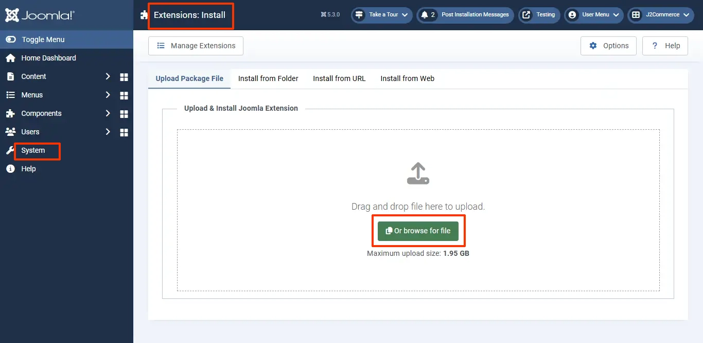

# Requirements and Installation

## Requirements <a href="#requirements" id="requirements" />

1. PHP 5.4+
2. J2Commerce 3.2.20 or above
3. Joomla 3.4.x or above

## Download App <a href="#installation" id="installation" />

**Step 1:** Go to our [J2Commerce website](https://www.j2commerce.com/) > Extensions > Apps

**Step 2:** Go to Extensions > Apps > Locate the Subscription & Membership App > click View Details > Add to cart > Checkout.

**Step 3:** Click on your profile dropdown in the top right corner and click on My Downloads. In the search bar, type in Subscriptions and Membership.&#x20;

.webp>)

When the app is shown, double-click on it to open it.

**Step 4:** Click View Files

**Step 5:** Click Download Now

## Install App <a href="#installation" id="installation" />

1. After downloading the app, go to the backend of your site and go to System > Install > Extensions.
2. Drag and drop your zip folder or click on Browse Your File. Don't unzip the folder

.webp>)

1. After installing the app, go to J2Commerce > Apps and enable the Subscription Products app.

Once enabled, open the app and configure the basic settings of the app.

To read the documentation on the basic settings, go to [https://docs.j2commerce.com/subscriptions-and-memberships/basic-settings](https://docs.j2commerce.com/subscriptions-and-memberships/basic-settings)
