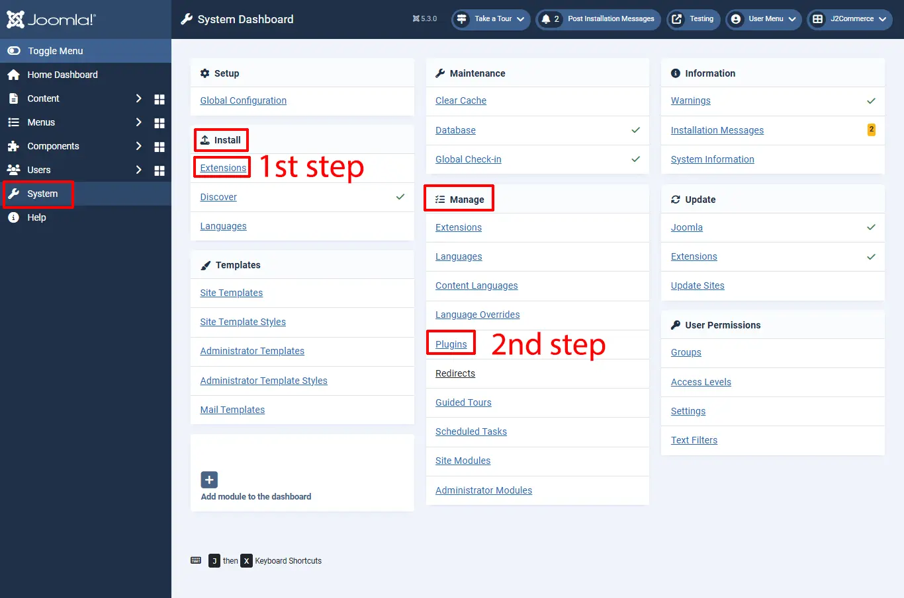
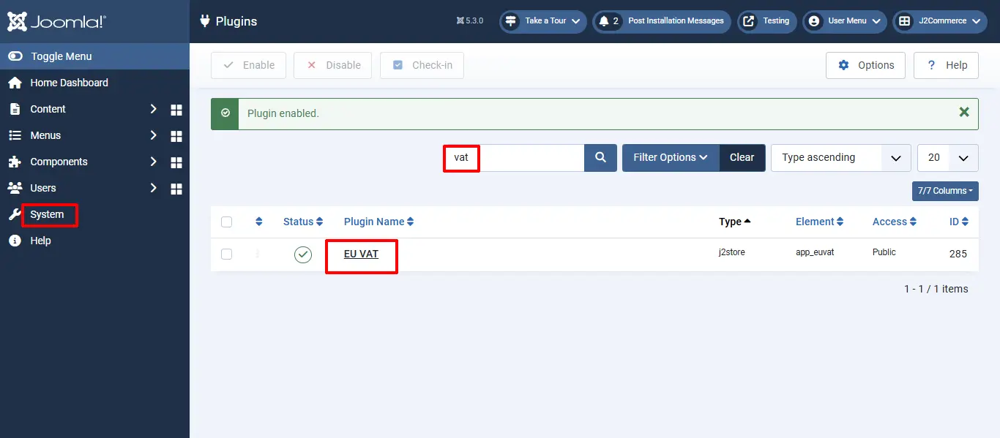

# A simplified guide for the New EU VAT rules 2015 for digital goods and setting them up in J2Commerce

If you are a seller of digital goods and services, you would probably be wondering about the new European VAT rules that came into effect from January 1, 2015.

Since the rules are a bit of a pain, we have come up with a simplified guide that will help you implement the new rules easily in your J2Commerce Joomla! shopping cart.

**The New VAT rules**

In simple terms, the new VAT rules are:

- If the company sells to any country in the EU, it will have to charge VAT in the country of the buyer instead of the seller.
- If the buyer of the digital goods is an individual, the company has to charge the VAT percentage from the country of buyer
- If the buyer of the digital goods is a company (with a valid VAT number), there is a 0 percent VAT charge.
- If the buyer of the digital goods is a company without a VAT number or has an incorrect VAT number, then VAT of the country of the buyer must be charged.
- If the company sells digital goods to companies or individuals in their own country, local VAT needs to be charged.

## Purchase the European VAT plugin

We have created a VAT plugin that helps you implement the VAT rules automatically. Download and install the plugin. &#x20;

**Step 1:** Go to [J2Commerce](https://www.j2commerce.com/) > Extensions > App

**Step 2:** Locate the European VAT App > click View Details > Add to cart > Checkout.

**Step 3:** Go to your My Downloads under your profile button at the top right corner and search for the app. Click Available Versions > View Files > Download Now

## Installing the App

**Step 1:** Go to System  > Install > Extension > to install the plugin

**Step 2:** Go to System > Manage > Plugins and search for EU VAT and enable the EU VAT plugin

## Implementation

Let us assume that your company is located in: United Kingdom, Bristol, and your home country (local ) VAT is 21 %

### Store Configuration

Go to Components > J2Commerce > Setup > Configuration > Store tab

Set the Default Country to the United Kingdom.&#x20;

Set your Default Zone to Bristol

### Tax rule for Home Country

First, we should define the geo zone and tax rates for the home country, that is the country in which your shop is located.

2.1 **Define Geo Zone**

Go to Components > J2Commerce > Localization > Geo Zones > New

**Geo Zone Name:** Home VAT Zone ( It can be anything. It is used just as a reference )

**Status:** Enabled

**Add country / Zone**

Choose the United Kingdom from the Dropdown list and add it

Save and close

2.2. **Define Tax rate:**

Go to Components > J2Commerce > Localization > Tax Rates > New

**Name:** Home VAT Rate

**Tax Percent:** 21

**Geo Zone:** Home VAT Zone&#x20;

**Status:** Enabled

Tax rule for an EU Country. Let us take Germany as an example. Let us say, Germany’s VAT charge is: 25 %

A few countries might have the same VAT rate for digital goods. You can group them under one geo zone.

For this example, I am going to stick with one EU country, that is Germany.

**3.1 Define Geo Zone**

Go to Joomla admin – J2Commerce – Localization – Geo zones – New

**Geo Zone Name:** Germany VAT Zone ( It can be anything. It is used just as a reference )

**Status:** Enabled

Add country / Zone

Choose Germany from the Dropdown list and add it

If some other EU countries also implement a 25 % VAT, then you can group them under this geo zone itself

Save and close

**3.2. Define Tax rate:**

Go to Components > J2Commerce > Localization > Tax Rates > New

**Name:** Germany VAT Rate&#x20;

**Tax Percent:** 25

**Geo Zone:** Germany VAT Zone

**Status:** Enabled

## Setting up the Tax Profile

It is sufficient to set up ONE tax profile for digital goods, in which we can associate many tax rates.

Go to Components > J2Commerce > Localization > Tax Profiles > New

**Tax Profile Name:** Digital Goods Tax Profile

**Status:** Enabled

## Setting up the Tax Rates Mapping

4.1. Choose Home VAT Rate 21 % and choose Billing Address as the Associated Address.

4.2. Choose the Germany VAT Rate 25 % and choose Billing Address as the Associated Address.

Save.

## Applying a tax profile to a product

J2Commerce uses native Joomla articles as products. So go ahead and create a product.

Go to Content > Article > New or open your digital product.

Select the J2Commerce (J2Store Tab) > Tax Profile, and Choose Digital Goods Tax Profile.

Fill in other relevant fields for your product and save.

**Application of VAT rules with Examples:**

Now we have successfully configured the tax rules in J2Commerce. Let us see how they will be applied to different scenarios

**Example 1: Buyer ( can be an INDIVIDUAL or company ) from the same country (Home country )**

Our shop is located in the United Kingdom. And the buyer is from the same country. So the local tax of 21 percent applies.

**Example 2: Buyer ( INDIVIDUAL ) from a different EU country (Germany )**

The buyer is from Germany and he is an Individual customer. So we are charging him the German VAT rate of 25 %

**Example 3: Buyer ( COMPANY ) from a different EU country WITHOUT a valid VAT Number**

The customer is from Germany. He has entered a company name. But his VAT number is INVALID. So we apply Germany’s VAT rate of 25 %.

(The EU VAT plugin validates the VAT number provided against the EU database.)

**Example 4: Buyer ( COMPANY ) from a different EU country WITH a valid VAT Number**

The customer is from Germany. His VAT number is VALID. So NO tax is applied. If you have any questions or suggestions, please post in the ticket system.
