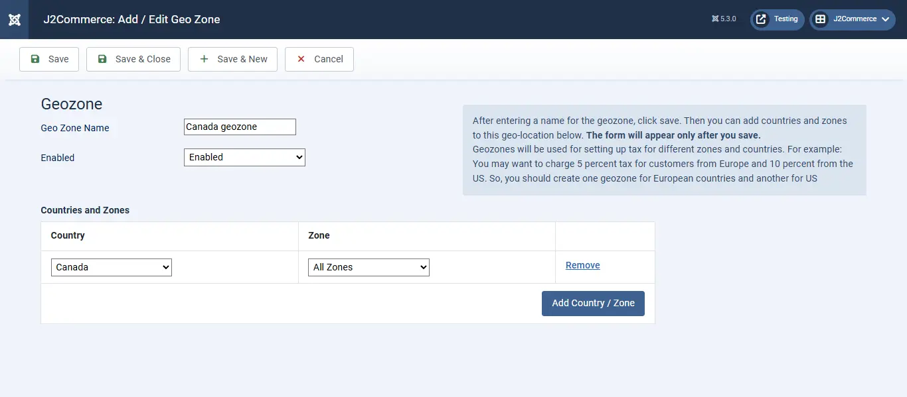
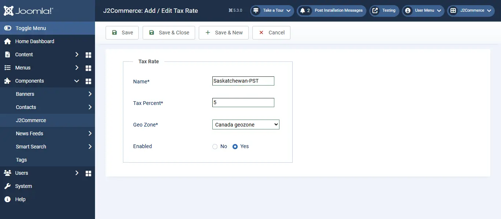
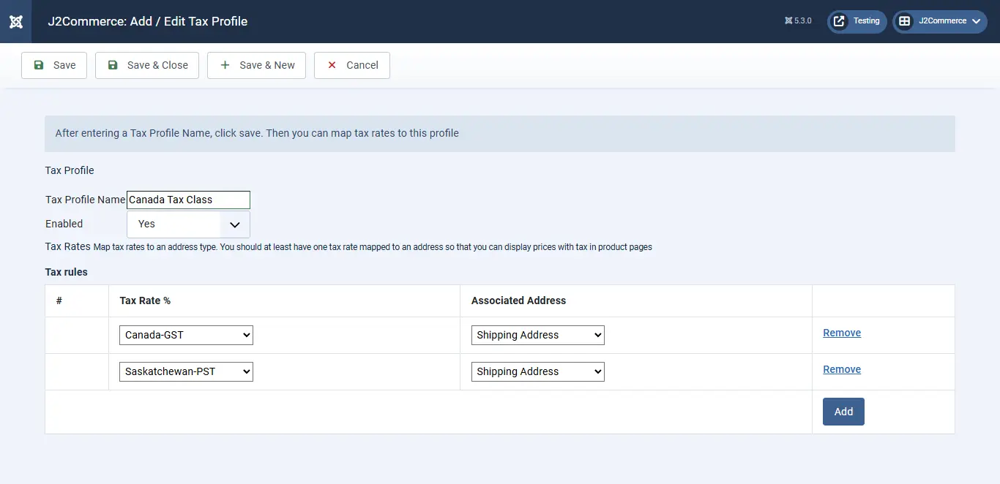
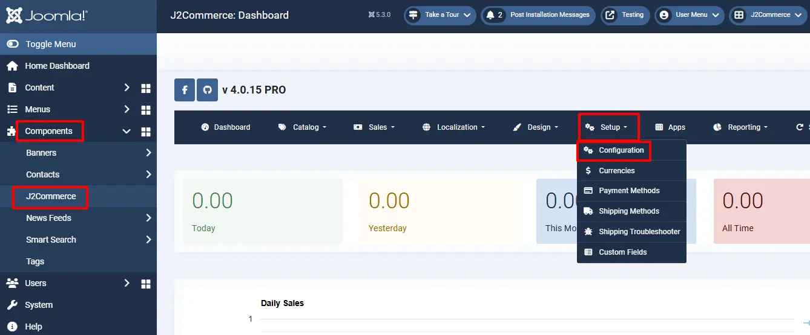
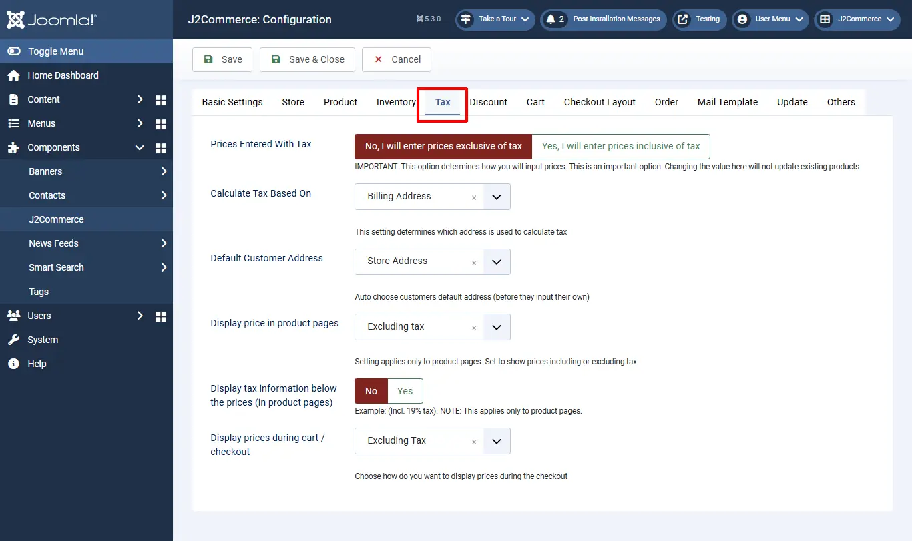
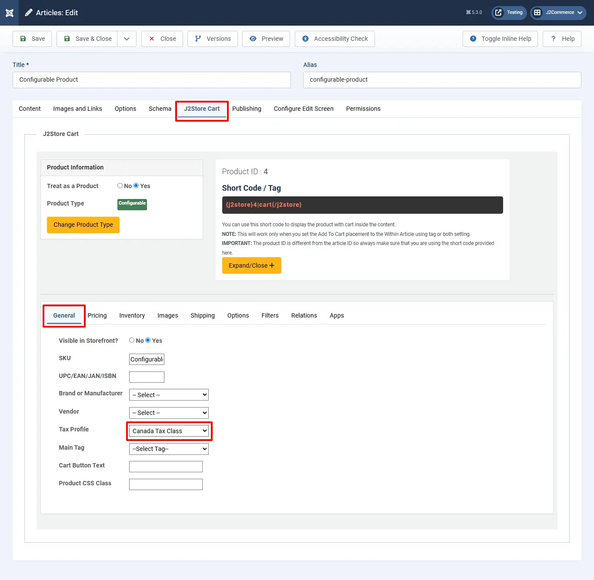

# Recommended Tax configuration for Canadian Stores

This is an example setting for stores in Canada. For detailed information on taxes, please consult an expert. J2Commerce is not held responsible VAT / Tax changes.

> NOTE: The example given below, assumes you have a store in Canada, Saskatchewan and you charge 5% GST and 5 % Saskatchewan-PST on the goods sold to customers.

## Create a geozone for Canada <a href="#step-1--create-a-geozone-for-texas" id="step-1--create-a-geozone-for-texas" />

Go to Components > J2Commerce > Localisation > Geo Zones

.webp>)

**Select New**

**Geo Zone Name:** Canada geozone

**Country:** Canada

**Zone:** All zones

## Create a tax rate <a href="#step-2-create-a-tax-rate" id="step-2-create-a-tax-rate" />

&#x20;Go to J2Commerce > Localisation > Tax Rates

.webp>)

**Select New**

**Name:** Canada-GST

**Tax Percent:** 5

**Geo Zone:** Canada geo zone

**Enabled:** Yes

## Create another tax rate for Saskatchewan-PST <a href="#step-3-create-another-tax-rate-for-saskatchewan-pst" id="step-3-create-another-tax-rate-for-saskatchewan-pst" />

Go to J2Commerce > Localization > Tax Rates > New

**Name:** Saskatchewan-PST

**Tax Percent:** 5

**Geo Zone:** Canada geo zone

**Enabled:** Yes

## Create a tax profile and rules <a href="#step-4-create-a-tax-profile-and-rules" id="step-4-create-a-tax-profile-and-rules" />

Go to J2Commerce > Localization  > Tax Profiles

.webp>)

**Select New**

**Name:** Canada Tax Class

**Enabled:** Yes

**Tax Rules:** Click Add

**Tax Rate:** Canada - GST

**Associated Address:** Shipping Address

**Click Add**

**Rate:** Saskatchewan-PST

**Associated Address:** Shipping

## Configure tax settings <a href="#step-5-configure-tax-settings" id="step-5-configure-tax-settings" />

Go to J2Commerce > Setup  > Configuration

&#x20;**Tax tab**

**Prices Entered with Tax:** No, I will enter prices EXCLUSIVE of tax

**Calculate tax based on:** Shipping address

**Default Customer address:** Store address

**Display prices on product pages:** Excluding tax

**Display prices in cart / checkout:** Excluding tax

**Apply discounts:** Before tax

**Save.**

## Adding the tax profile to a product <a href="#step-6-create-a-product-and-choose-the-tax-profile" id="step-6-create-a-product-and-choose-the-tax-profile" />

J2Commerce uses Joomla! articles as products. So go to Article Manager and create a New Article / Product (If you use any other catalog source like Zoo or Sebold, you should head there).

Product creation steps are explained under the topic Products.

Here, let us just see how to choose the tax profile

Go to J2Commerce (or J2Store Cart) tab > General tab

**Tax Profile:** Canada Tax Class

IMPORTANT: If you do not choose the tax profile, then tax will not apply in the storefront.

## Video Tutorial: <a href="#video-tutorial" id="video-tutorial" />

