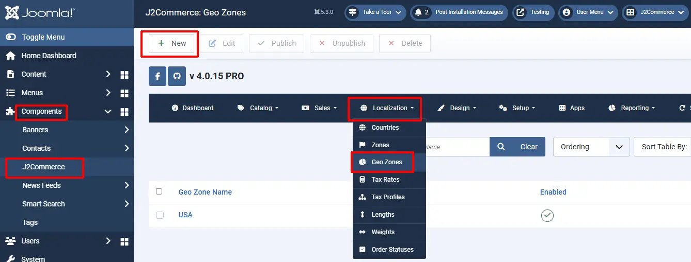
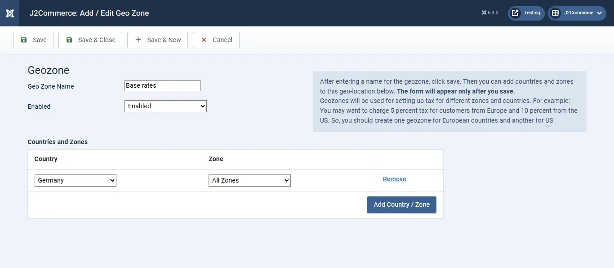
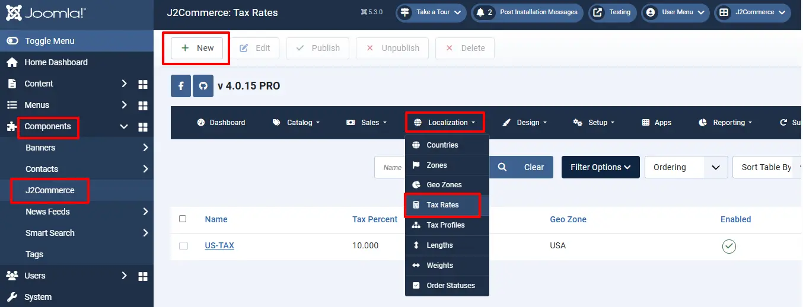
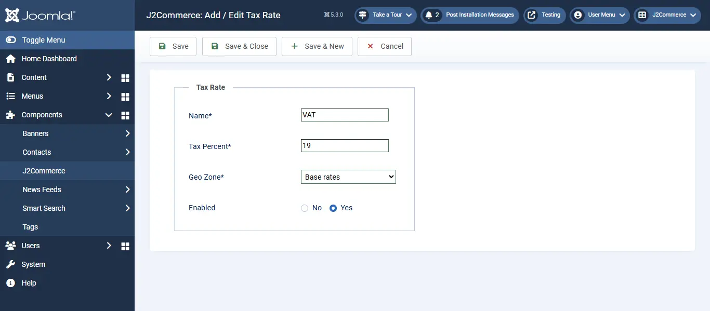
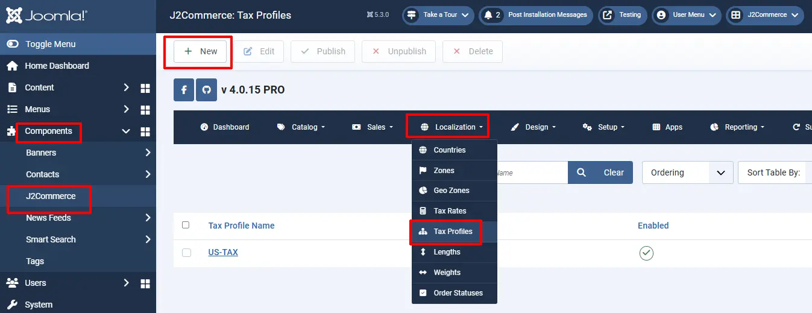
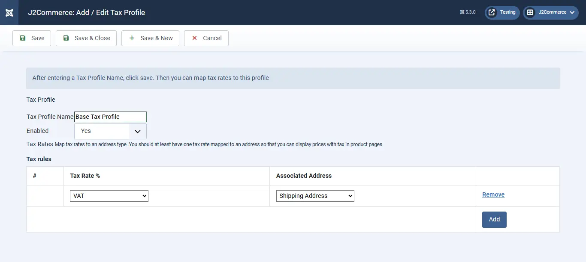
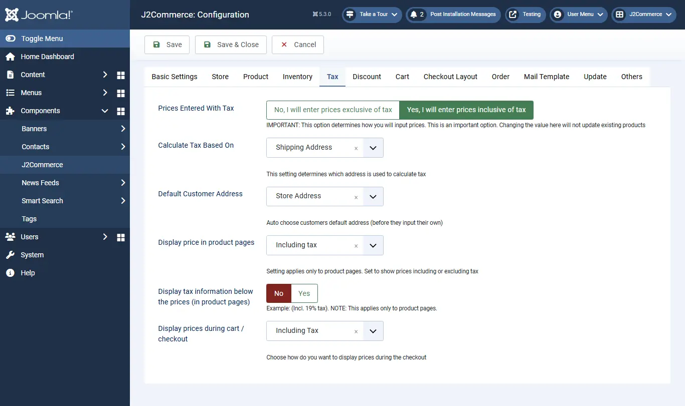
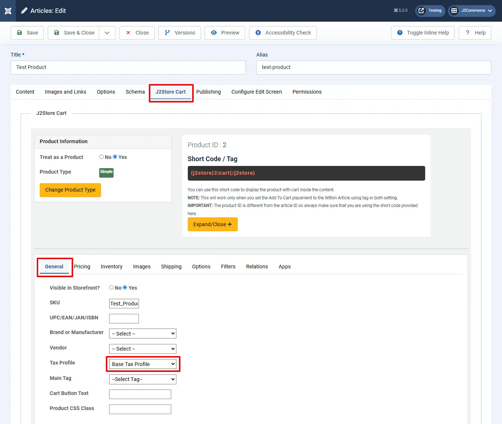

# Recommended Tax Configuration for EU stores

This guide will walk you through the configuration of tax in J2Commerce for EU stores. This is an example configuration for stores in Europe. For detailed information on tax, please consult an expert. J2Commerce is not held responsible for VAT / Tax changes.

> Important: No guarantee is offered with respect to any of the information given here. Please contact an expert before you take any decisions about tax matters.

NOTE: The example assumes you have a store in Germany and you charge 19% tax on the goods. All customers originating from Germany are charged 19 % of tax.

## Create a geozone for base rates (home country tax) <a href="#step-1--create-a-geozone-for-base-rates-home-country-tax" id="step-1--create-a-geozone-for-base-rates-home-country-tax" />

Go to Components > J2Commerce > Localization -> Geozones

**Select New**

**Geozone Name:** Base rates

**Country:** Germany

**Zones:** All

## Create a tax rate <a href="#step-2-create-a-tax-rate" id="step-2-create-a-tax-rate" />

Go to J2Commerce > Localization > Tax Rates

**Select New**

**Name:** VAT

**Tax Percent:** 19

**Geo Zone:** Base rates

**Status:** Enabled

## Create a tax profile and rules <a href="#step-3-create-a-tax-profile-and-rules" id="step-3-create-a-tax-profile-and-rules" />

Go to J2Commerce > Localization > Tax Profiles

**Select New**

**Name:** Base Tax Profile

**Enabled:** Yes

**Tax Rules:** Click Add

**Tax Rate:** VAT

**Associated Address:** Shipping

## Configure tax settings <a href="#step-4-configure-tax-settings" id="step-4-configure-tax-settings" />

Go to J2Commerce > Setup > Configuration

**Select New**

**Prices Entered with Tax:** Yes, I will enter prices with tax

**Calculate tax based on:** Shipping address

**Default Customer address:** Store address

**Display prices on product pages:** Including tax

**Display prices in cart / checkout:** Including tax

**Apply discounts:** After tax

**Save**.

## Adding the tax profile to a product <a href="#step-5-create-a-product-and-choose-the-tax-profile" id="step-5-create-a-product-and-choose-the-tax-profile" />

J2Commerce uses Joomla! articles as products. So, go to Article Manager and create a New Article / Product (If you use any other catalogue source like Zoo or Sebold, you should head there).

Product creation steps are explained under the topic Products.

Here, let us just see how to choose the tax profile:

Go to J2Commerce (or J2Store Cart) tab  > General tab

**Tax Profile:**  Base tax profile

IMPORTANT: If you do not choose the tax profile, then tax will not apply in the storefront.

## Selling in multiple countries with multiple tax rates <a href="#step-6-selling-in-multiple-countries-with-multiple-tax-rates" id="step-6-selling-in-multiple-countries-with-multiple-tax-rates" />

If you are selling your products to other countries in Europe, then there are three scenarios

- Charge the same VAT rate for customers from certain countries. In this case, you will just have to open the Base Geozone and add the countries / zones to which you want to charge 19%. Then all customers from all those countries will be charged the 19% tax rate.
- Charge a different VAT rate for customers from certain countries.  Let us say you want to charge 12% tax for customers from Switzerland and France. Create a new Geozone and include Switzerland and France. Create a new tax rate and set the tax percent to 12%. Go to Components > J2Commerce > Localization > Tax Profiles > Open Base tax profiles. Under Tax rules, click add, choose your New tax rate, and associate it with the Shipping address. Save. Now, customers from Switzerland and France will be charged 12 % of tax instead of your base rate of 19%.

Video Tutorial:

