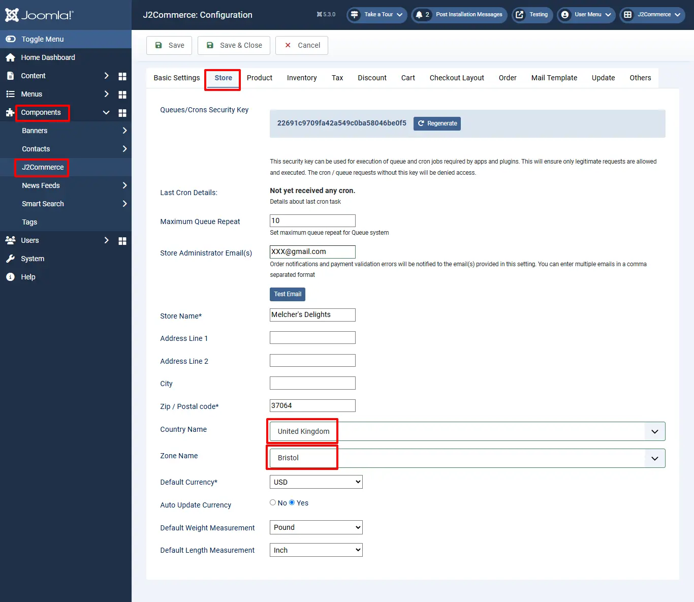
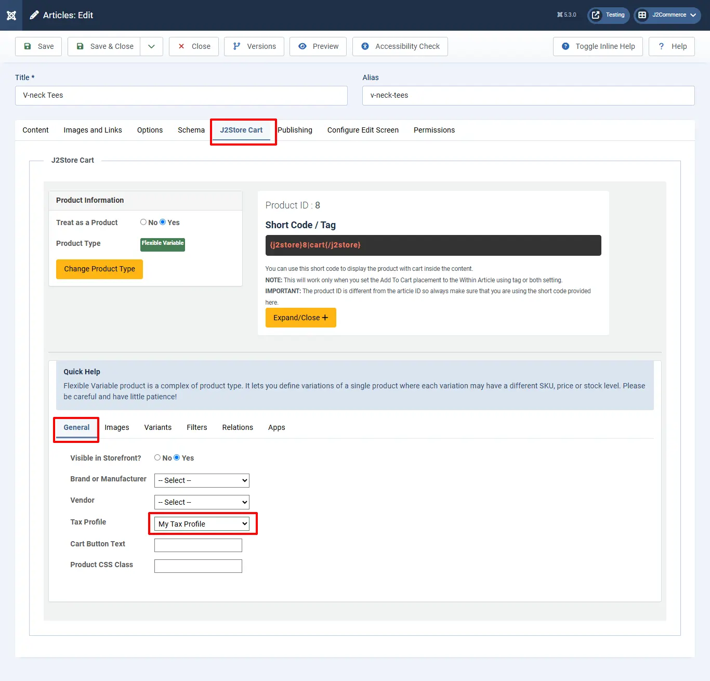
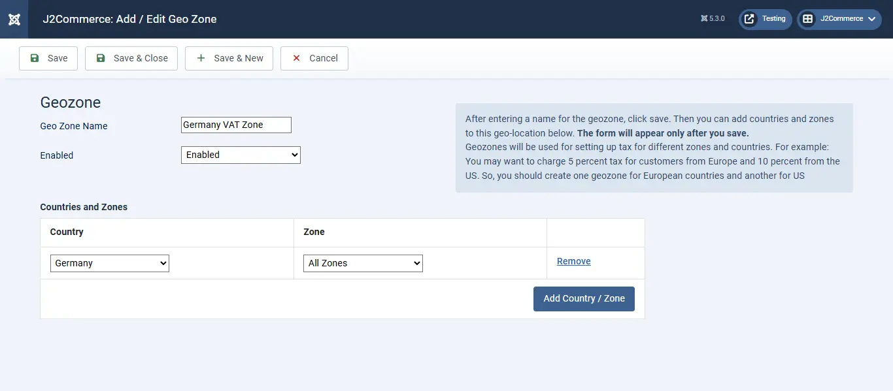
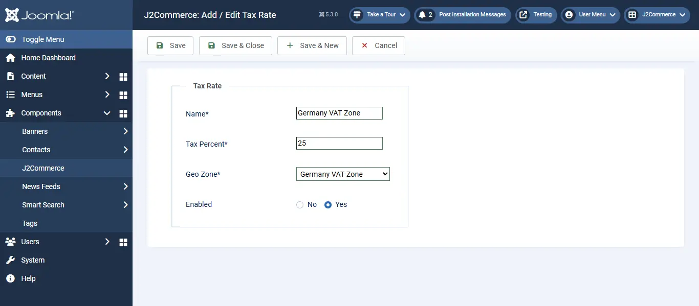
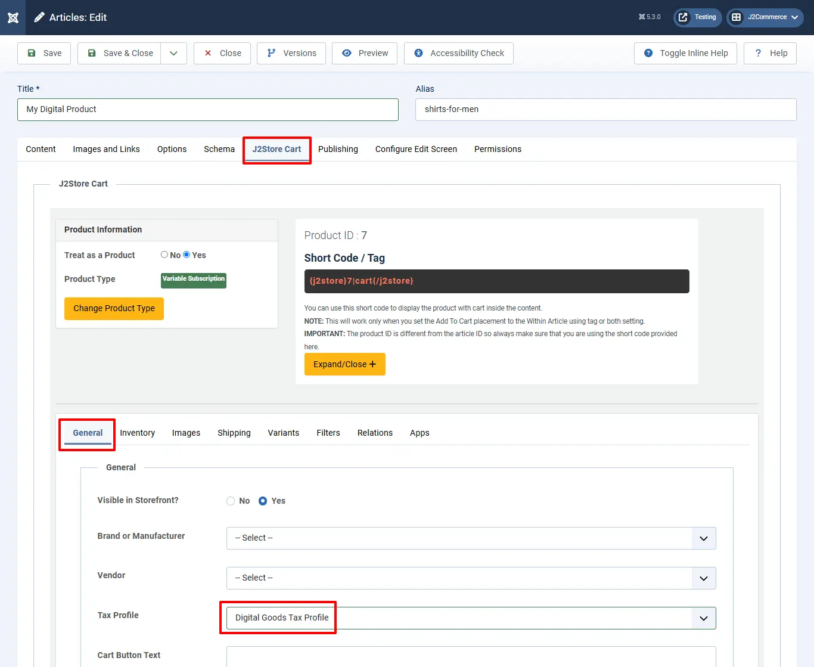

# Setting up European VAT Rules for Selling Physical Goods with J2Commerce

Setting up the European VAT system in J2Commerce is relatively easy. We have created a plugin that automatically validates the VAT number and helps you apply the rules. For detailed information on taxes, please consult an expert. J2Commerce is not held responsible VAT / Tax changes.

This guide walks you through the tax configuration for EU.

## The VAT rules are: <a href="#the-vat-rules-are" id="the-vat-rules-are" />

- Home country’s residents & businesses are charged VAT (Home country’s rate. That is, the rate defined by you in the Tax Profile.
- EU residents & businesses with no valid VAT number will be charged VAT (Home country’s rate, that is, the rate defined by you in the Tax Profile).
- EU (Non Home country) and with a valid VAT number are charged 0% VAT.
- Non-EU residents & businesses are charged 0% VAT.

### Implementing VAT rules in J2Commerce <a href="#implementing-vat-rules-in-j2store" id="implementing-vat-rules-in-j2store" />

We have created a VAT plugin that helps you implement the VAT rules automatically. Download and install the plugin from here:[http://j2store.org/extensions/general-plugins.html](http://j2store.org/extensions/general-plugins.html)

Let us assume that your company is located in : United Kingdom, Bristol, and your home country (local ) VAT is 21 %.

### Store Profile <a href="#store-profile" id="store-profile" />

Go to Joomla admin – J2Commerce – Setup – Configuration - > Store tab.

Set the Country Name to United Kingdom

Set your Zone Name to Bristol.

### Geo Zone <a href="#geozone" id="geozone" />

Go to Components > J2Commerce > Localization > Geo Zones > New

**Setting up the Parameters**

**Geo Zone Name:** VAT Zone ( It can be anything. It is used just as a reference )&#x20;

**Status:** Enabled

**Add Country / Zone:** Choose United Kingdom from the Dropdown list and add it

**IMPORTANT:** According to the rule, EU residents & businesses with no valid VAT number have to be charged based on the home country’s rate.

So it is advised that you add all the EU countries to this Geo Zone itself. Choose EU VAT countries and add them. Refer to this article to know all EU VAT countries. [http://en.wikipedia.org/wiki/European\_Union\_value\_added\_tax](http://en.wikipedia.org/wiki/European_Union_value_added_tax)

(You can also add all other European countries, or create a separate Geo Zone. But then you will have to create a tax rate and map that in the tax profile. Kind of a double work!).

Save and close

### Tax rate <a href="#tax-rate" id="tax-rate" />

Go to Components > J2Commerce > Localization > Tax Rates > New

**Name:** VAT Rate&#x20;

**Tax Percent:** 21&#x20;

**Geo Zone:** VAT Zone

**Status:** Enabled

### Setting up the tax profile <a href="#setting-up-the-tax-profile" id="setting-up-the-tax-profile" />

It is sufficient to set up ONE tax profile

Go to Components > J2Commerce > Localization > Tax Profiles > New

**Tax Profile Name:** My Tax Profile&#x20;

**Enabled:** Yes

**VAT Rate:** 21 %&#x20;

**Associated Address:** Billing Address&#x20;

Save.

### Applying a tax profile to a product <a href="#applying-tax-profile-to-a-product" id="applying-tax-profile-to-a-product" />

J2Commerce uses native Joomla! articles as products. So go ahead and create a product.

Go to Content > Articles > New or open your digital product.

In J2Commerce (J2Store Tab) > Tax Profile > Choose My Tax Profile.

Fill in other relevant fields for your product and save.

## Implementation <a href="#implementation" id="implementation" />

Let us assume that your company is located in : United Kingdom, Bristol, and your home country (local ) VAT is 21 %

### **Store Profile**

Go to Components > J2Commerce > Setup > Store Profiles > Your store profile.

Set the Default Country to the United Kingdom.&#x20;

Set your Default Zone to Bristol

## **Tax rule for Home Country**

First, we should define the Geo Zone and tax rates for the home country, that is the country in which your shop is located.

### Define Geo Zone

Go to Components > J2Commerce > Localization > Geozones > New

**Setting the parameters:**

**Geo Zone Name:** Home VAT Zone ( It can be anything. It is used just as a reference )&#x20;

**Status:** Published&#x20;

**Add country / Zone:** Choose United Kingdom from the Dropdown list and add it&#x20;

Save and close

### Define Tax rate

!\[vat 2015 home taxrate (./assets/images/vat\_2015\_home\_taxrate.png)

Go to Components > J2Commerce > Localization > Tax Rates > New

**Setting the parameters:**

**Geo Zone Name:** Home VAT Rate&#x20;

**Tax Percent:** 21&#x20;

**Geo Zone:** Home VAT Zone&#x20;

**Status:** Published

## **Tax rule for an EU Country**

Let us take Germany as an example. Let us say, Germany’s VAT charge is: 25 %

NOTE: A few countries might have the same VAT rate for digital goods. You can group them under one geo zone. For this example, I am going to stick with one EU country, that is Germany.

### Define Geo Zone

### Define Tax rate

Go to Joomla admin > J2Commerce > Localization > Geo Zones > New&#x20;

**Setting the parameters:**

**Geo Zones Name:** Germany

&#x20;**VAT Zone:** ( It can be anything. It is used just as a reference )&#x20;

**Status:** Published&#x20;

**Add country / Zone:** Choose Germany from the Dropdown list and add it&#x20;

NOTE: If some other EU countries also implement a 25 % VAT, then you can group them under this geo zone itself.

Save and close

## Setting up the tax profile

It is sufficient to set up ONE tax profile for digital goods, in which we can associate many tax rates.

\`Go to Joomla admin > Components > J2Commerce > Localization > Tax profiles > New

**Setting the parameters:**

**Tax Profile Name:** Digital Goods Tax Profile&#x20;

**Enabled:** Yes

### Tax Rates Mapping

**Home VAT Rate:** 21 %&#x20;

**Associated Address:** Choose Billing Address

**Germany VAT Rate:** 25 %

**Associated Address:** Choose Billing Address

Save.

.webp>)

## **Applying tax profile to a product**

J2Commerce uses native Joomla! articles as products. So go ahead and create a product by going to Content > Articles > New

**Application of VAT rules with Examples:** Now we have successfully configured the tax rules in J2Commerce. Let us see how they will be applied to different scenarios

**Example 1:**&#x20;

Buyer ( can be an INDIVIDUAL or company ) from the same country (Home country )

Our shop is located in the United Kingdom. And the buyer is from the same country. So the local tax of 21 percent applies.

**Example 2:**

Buyer ( INDIVIDUAL ) from a different EU country (Germany )

The buyer is from Germany and he is an Individual customer. So we are charging him the Germany’s VAT rate of 25 %

**Example 3:**

Buyer ( COMPANY ) from a different EU country WITHOUT a valid VAT Number

The customer is from Germany. He has entered a company name. But his VAT number is INVALID. So we apply Germany’s VAT rate of 25 %.

(The EU VAT plugin validates the VAT number provided against the EU database.)

**Example 4:**

Buyer ( COMPANY ) from a different EU country WITH a valid VAT Number

The customer is from Germany. His VAT number is VALID. So NO tax is applied.
